I am a Theoretical Physics student at the University of York. I mainly spend time on simulation based programming for my degree but in my free time I will do just about anything, with a special interest in making things work for my Macbook

## GitHub Stats

  
  

## Languages

## Contribution Snake

<picture>
  <source media="(prefers-color-scheme: dark)" srcset="https://raw.githubusercontent.com/jofl1/jofl1/output/github-snake-dark.svg" />
  <source media="(prefers-color-scheme: light)" srcset="https://raw.githubusercontent.com/jofl1/jofl1/output/github-snake.svg" />
  
</picture>

